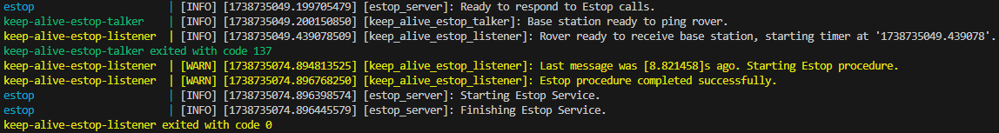

## About
ROS 2 nodes to poll connectivity between base and remote station. Nodes requests estop service if listener doesn't receive any topic updates from talker after a certain timeout. Beta test for keep-alive estop mechanism for Sydney Interplanetary Rover Initiative (SIRI).



## Manual setup
Assuming `ros-humble-desktop` is installed, run:

```bash
cd keep-alive-test
source /opt/ros/humble/setup.bash
colcon build --packages-select keep_alive_estop estop_interfaces estop --symlink-install --cmake-args -DCMAKE_EXPORT_COMPILE_COMMANDS=ON 
source install/setup.bash
```
Run each executable:
```bash
ros2 run estop estop_server
ros2 run keep_alive_estop keep_alive_estop_talker_node
ros2 run keep_alive_estop keep_alive_estop_listener_node
```

Alt:
```bash
colcon build --packages-select keep_alive_estop estop_interfaces estop --symlink-install --cmake-args -DCMAKE_EXPORT_COMPILE_COMMANDS=ON &&
source install/setup.bash
```

## Docker
Assuming docker is installed, run the following to launch all executables

```bash
docker compose up
```

To run any individual docker compose container (via its service name):

```bash
docker compose run --rm keep-alive-estop-talker
docker compose run --rm keep-alive-estop-listener
docker compose run --rm estop
```

To stop any of the containers (via its service name),

```bash
docker compose stop keep-alive-estop-talker
docker compose stop keep-alive-estop-listener
docker compose stop estop
```

To use the docker container as a shell containing all the repositories' (built) code,

```bash
docker compose run --remove-orphans terminal
```

## TODO
- test on different devices
- multi-stage builds